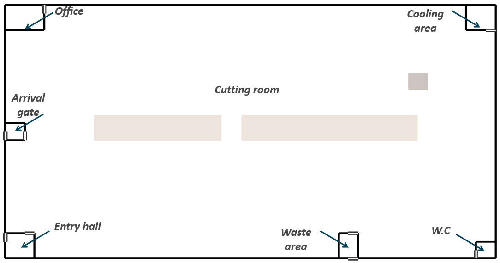
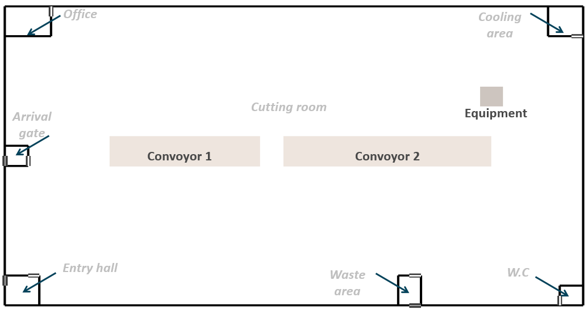
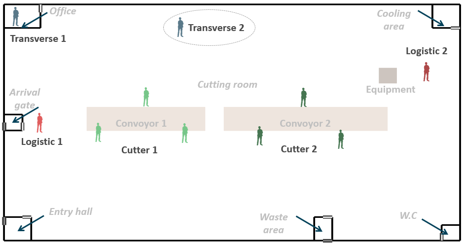

```{r setup, include=FALSE}
knitr::opts_chunk$set(echo = TRUE)
library(ggplot2)
library(DiagrammeR)
library(kableExtra)
library(dplyr)
library(mvtnorm)
library(mc2d)
library(MASS)
library(survival)
library(fitdistrplus)
```

## Context

The Agent Based Model considered ....

## Parameters of interest 

### Parameters associated to plant
*The parameter relative to the plant will be entered in the file : parameters_plant.R*

The model requires the construction of the plan of the processing plant. 
Here are the elements taken into account for six rooms in the whole plant. 

+ Cutting Room (it is the main room of the plant) 
+ Entry hall
+ Waste area
+ W.C.
+ Cooling area
+ Office
+ Arrival gate


Each room needs to be positioned on the entire workshop grid. The cutting room is the main build by substracting all other rooms. 
The position of the door is also mentioned with four variables : "top", "bottom", "left" or "right".



```{r table of room in plant parameter, echo=FALSE}
data<-read.csv("parameters_room_plant.csv",sep=";",header = T)
data<-as.data.frame(data)
data<-data[,]
knitr::kable(
  data,col.names = gsub("[.]", " ", names(data)),
  caption = 'Table 1. Set of parameters for charateryzing the room in the plant. The cutting room is built by subtracting the other room'

)%>%kable_styling('striped', font_size = 12) %>%
pack_rows("*Entry hall* : The entry hall, or cloakroom, is located at the bottom left and allows the arrival of workers.", 3, 3)%>%
pack_rows("*Waste area* :  waste disposal area is at the bottom.", 4, 4)%>%
pack_rows("*W.C.* : The toilets are located at the bottom left.", 5, 5)%>%
pack_rows("*Cooling area* : The cooling room is located at the top right.", 6, 6)%>%
pack_rows("*Office* : The offices are located at the top left.", 7, 7)%>%
pack_rows("*Arrival gate* : The product arrival gate, allows the supply of products, is located in the middle of the left" , 8, 8)
  
```


For this purpose each room has to be defined. Two elements are taken into account 

- the dimensions of the rooms: length, width and height 
- the parameters related to the ventilation of the room


The kind of ventilation type could be : 

- Controlled Mecanical Ventilation [CMV]
- Direct Expansion Coil [DEC]
- Air Handing Unit [AHU]


```{r table of plant parameter, echo=FALSE}
data<-read.csv("parameters_plant.csv",sep=";",header = T)
data<-as.data.frame(data)
data<-data[,]
knitr::kable(
  data,col.names = gsub("[.]", " ", names(data)),
  caption = 'Table 2. Set of parameters used for charateryzing the plant.'
)%>%
  kable_styling('striped', font_size = 11)%>%
pack_rows("*Cutting room*" , 2, 6)%>%
pack_rows("*Entry hall*" , 7, 10)%>%
  pack_rows("*Waste area* ", 11, 14)%>%
pack_rows("*W.C.* ", 15, 18)%>%
pack_rows("*Cooling area* ", 19, 22)%>%
pack_rows("*Office*", 23, 26)%>%
pack_rows("*Arrival gate* " , 27, 30)%>%

## Justification line need to be edit
row_spec(4:6, color = "red")%>%
row_spec(8:10, color = "red")%>%
row_spec(12:14, color = "red")%>%
row_spec(16:18, color = "red")%>%
row_spec(24:26, color = "red")%>%
row_spec(29:30, color = "red")
     
```


### Parameters associated to differnts objets in the plant 

The objects must be defined. They are positioned in the model on the X and Y axis, together with the dimensions. 

We have implemented two types of objects: two conveyors, that allows the pieces of meat to be transported from one point to another, and an equipment that can be shared by several operators, such as a peeler. 



```{r table of object in plant parameter, echo=FALSE}
data<-read.csv("parameters_object_plant.csv",sep=";",header = T)
data<-as.data.frame(data)
data<-data[,]
knitr::kable(
  data,col.names = gsub("[.]", " ", names(data)),
  caption = 'Table 3. Set of parameters for charateryzing the different object in the plant. '

)%>%kable_styling('striped', font_size = 12) 

```


```{r table of time parameter, echo=FALSE}
data<-read.csv("parameters_time.csv",sep=";",header = T)
data<-as.data.frame(data)
data<-data[,-6]
knitr::kable(
  data,col.names = gsub("[.]", " ", names(data)),
  caption = 'Table 2. Set of parameters used for charateryzing the durations of the simulation.'
)%>%kable_styling('striped', font_size = 10)

```

### Parameters associated to worker

*The parameter relative to the simulation time will be entered in the file :  parameters_workers.R*

The operators are differentiated according to their functions

- Cutter 1 : deboning or cutting carcasses into large pieces 
- Cutter 2 : cutting large pieces into small pieces 
- Logistic 1 : bringing the carcasses to the cutters 
- Logistic 2 : recover cut products then pack and store
- Transverse 1: manager / chief / maintenance staff who come to the workshop a few times a day
- Transverse 2: people from the cleaning team



```{r table of worker parameter, echo=FALSE}
data<-read.csv("parameters_worker.csv",sep=";",header = T)
data<-as.data.frame(data)
data<-data[,-6]
knitr::kable(
  data,col.names = gsub("[.]", " ", names(data)),
  caption = 'Table 3. Set of parameters used for charateryzing the worker of the plant.'
)%>%kable_styling('striped')%>%
pack_rows("*Overall proportion for different types of workers *" , 5, 10)

```


### Parameters associated to air

# ```{r table of air parameter, echo=FALSE}
# data<-read.csv("parameters_air.csv",sep=";",header = T)
# data<-as.data.frame(data)
# data<-data[,-6]
# knitr::kable(
#   data,col.names = gsub("[.]", " ", names(data)),
#   caption = 'Table 4. Set of parameters used for charateryzing air in the meat plant.'
# )%>%kable_styling('striped', font_size = 10)
# 
# ```

### Parameters associated to food

# ```{r table of food parameter, echo=FALSE}
# data<-read.csv("parameters_food.csv",sep=";",header = T)
# data<-as.data.frame(data)
# data<-data[,-6]
# knitr::kable(
#   data,col.names = gsub("[.]", " ", names(data)),
#   caption = 'Table 5. Set of parameters used for charateryzing food in the meat plant.'
# )%>%kable_styling('striped', font_size = 10)
# 
# ```


### Parameters relative to the simulation time. 

*The parameter relative to the simulation time will be entered in the file :  parameters_time.R*

It consists in filling two parameters: 

- the total duration that will be simulated ("NDays" in the ABM, in days)
- the simulated time interval of the simulation ("Step" in the ABM, in minutes)

Parms_Time <- list(
  NDays = 365, ## total number of days during the entire process
  Step = 5 ## time step (in minutes)
)

## References
