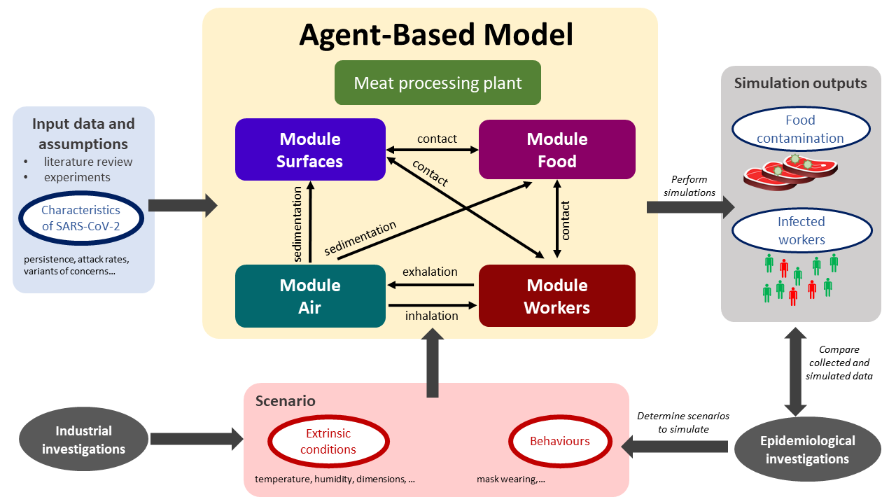
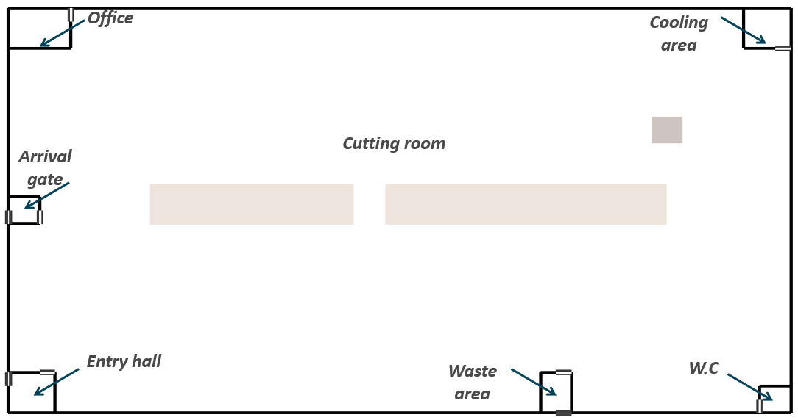
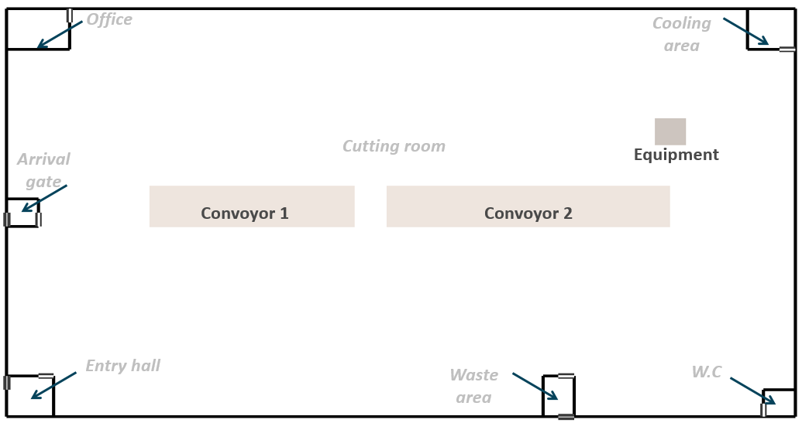
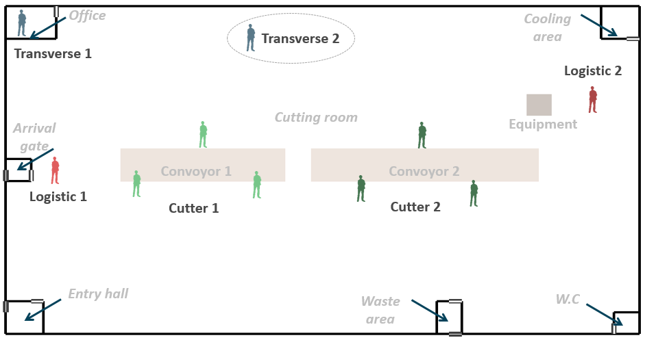
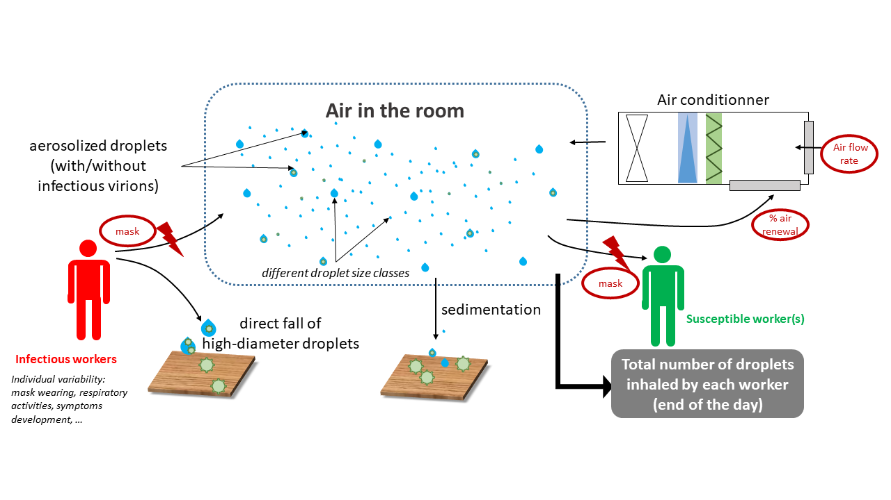

```{=html}
<style> div.main-container { max-width: 1400px; } </style>
```


**SACADA Project**

*April 2021 - September 2022*

```{r setup, include=FALSE}
knitr::opts_chunk$set(echo = TRUE)
library(ggplot2)
library(DiagrammeR)
library(kableExtra)
library(dplyr)
library(mvtnorm)
library(mc2d)
library(MASS)
library(survival)
library(fitdistrplus)
```

# **Introduction**

This modelling study aimed to...

The Agent Based Model considered three sources of contaminations: the
exposition to Sars-CoV2 througout working activities (aerosol and/or
fomites), the contamination throught the exposition outside the
processing plant for employees having shared activities in community
(transport and/or living).

In order to consider the first source of contamination (in the factory),
the durations of the stages of infections and the Viral load (viral RNA
concentration) exhaled by infected people have to be quantified. For
assessing the possibility of transmission in community the secondary
attack rate have to be quantified.

The different waves of Sars-CoV2 outbreaks that have occurred show that
each Variants of Concern, i.e. VoC (alpha, beta, delta and omicron
SARS-CoV-2 VoCs) have their own characteistics, e.g. different viral
load, or rates of reinfection [@Karim2021].

This document aims to identify the parameters of interest for building
the Agent Based Model of the ANR Sacada project.

# **Agent-based model: Description**

The ABM model is presented in this study according to the
Overview-Design-Details (ODD) protocol as recommended by @Grimm2010.

## **Overview**

The general concept of the agent-based modelling workflow developed in
this study is schematized in Figure \@ref(fig:FIG-abm-concept).

```{r FIG-abm-concept, echo=F, fig.align = 'center', out.width = "85%",fig.cap = "General concept of the Agent-based model to simulate the transmission of SARS-CoV-2 in meat processing facilities"}

```

**Purpose and patterns**

-   predict the contamination of the workers

-   predict the contamination of the food portions

-   predict the contamination of the

**States variables and scales**

**Process overview and scheduling**

## **Design concept**

**Basic principles**

<!-- **Emergence** -->

<!-- **Adaptation**  -->

<!-- **Objectives** -->

<!-- **Learning** -->

**Prediction** <!-- **Sensing** --> <!-- **Interaction** -->

**Stochasticity** <!-- **Collectives** --> <!-- **Observation** -->

## **Details**

### **Sub-models**

#### **Characteristics of the food processing plant**

**Dimensions and structures**

The plan of the multi-room food processing plant can be taken into
account in the model. Based on industrial investigations, seven
principal rooms (spaces) were included herein as an example to define
the plant structure, including the Cutting room (the main space of the
plant), Entry hall (for workers), Arrival gate (for food arrival into
the cutting room), Cooling area (for food storage), Waste area, W.C.,
and Office (illustration in Figure \@ref(fig:FIG-map-plant)).

```{r FIG-map-plant, echo=F, fig.align = 'center', out.width = "65%", fig.cap = "Plan of the processing plant"}

```

The different characteristics of each room are included as inputs of the
model :

-   dimensions of the plant and dimensions of the different rooms,
    expressed in *m* (the length and width on two axes, denoted X and Y
    axes, respectively, and height on a 3rd axis, denoted Z axis);
-   positions of the room in the plant;
-   presence and relative positions of internal/external door for each
    room;
-   ventilation specifications: several air conditioning types can be
    indicated such as Controlled Mechanical Ventilation (CMV), Direct
    Expansion Coil (DEC) or Air Handing Unit (AHU).

The above characteristics were defined in the model as model parameters
based on industrial investigations or previous works. The *(associated R
script: parameters_plant.R)*. For example, as illustrated in Table
\@ref(tab:TAB-plant-room-parameters), each room needs to be positioned
on the entire workshop grid using a numerical value between 0 and 1
indicating the relative position over the axes. The cutting room is the
main build by subtracting all other rooms. The position of the internal
and external doors can also be mentioned using the predefined values
"top", "bottom", "left" or "right" (Table
\@ref(tab:TAB-plant-room-parameters)).

```{r TAB-plant-room-parameters, echo=FALSE}
data<-read.csv("csv/parameters_room_plant.csv",sep=";",header = T)
data<-as.data.frame(data)
data<-data[,]
knitr::kable(
  data,
  col.names = gsub("[.]", " ", names(data)),
  caption = 'Set of parameters for charateryzing the room in the plant. The cutting room is built by subtracting the other room',
  table.attr = "style='width:85%;'"

)%>%kable_styling('striped', font_size = 10) %>%
pack_rows("*Entry hall* : The entry hall, or cloakroom, is located at the bottom left and allows the arrival of workers.", 3, 3)%>%
pack_rows("*Waste area* :  waste disposal area is at the bottom.", 4, 4)%>%
pack_rows("*W.C.* : The toilets are located at the bottom left.", 5, 5)%>%
pack_rows("*Cooling area* : The cooling room is located at the top right.", 6, 6)%>%
pack_rows("*Office* : The offices are located at the top left.", 7, 7)%>%
pack_rows("*Arrival gate* : The product arrival gate, allows the supply of products, is located in the middle of the left" , 8, 8)
  
```

```{r TAB-plant-parameters, echo=FALSE}
data<-read.csv("csv/parameters_plant.csv",sep=";",header = T)
data<-as.data.frame(data)
data<-data[,]
knitr::kable(
  data, col.names = gsub("[.]", " ", names(data)),
  table.attr = "style='width:85%;'",
  caption = 'Set of parameters used for charateryzing the plant.'
)%>%
  kable_styling('striped', font_size = 10)%>%
pack_rows("*Cutting room*" , 2, 6)%>%
pack_rows("*Entry hall*" , 7, 10)%>%
  pack_rows("*Waste area* ", 11, 14)%>%
pack_rows("*W.C.* ", 15, 18)%>%
pack_rows("*Cooling area* ", 19, 22)%>%
pack_rows("*Office*", 23, 26)%>%
pack_rows("*Arrival gate* " , 27, 30)%>%

## Justification line need to be edit
row_spec(4:6, color = "red")%>%
row_spec(8:10, color = "red")%>%
row_spec(12:14, color = "red")%>%
row_spec(16:18, color = "red")%>%
row_spec(24:26, color = "red")%>%
row_spec(29:30, color = "red")
     
```

**Equipment and objects**

The different objects or equipment can be included inside the plant such
as conveyors, peeler, etc. In the same ways as for the different rooms,
their dimensions and their relative position alongside the X and Y axes
are taken into account as model inputs. As illustrated in Figure
\@ref(fig:FIG-map-plant-object), two types of objects were included :
two conveyors allowing to transport the different carcasses or food
portions from one point to another, and an equipment that can be shared
by several operators (e.g.: a peeler, frequently used in meat cutting
plant). The parameters associated with these objects are gathered in
Table \@ref(tab:TAB-plant-object-parameters).

```{r FIG-map-plant-object, echo=F, fig.align = 'center', out.width = "65%", fig.cap = "Plan of the processing plant"}

```

```{r TAB-plant-object-parameters, echo=FALSE}
data<-read.csv("csv/parameters_object_plant.csv",sep=";",header = T)
data<-as.data.frame(data)
data<-data[,]
knitr::kable(
  data,col.names = gsub("[.]", " ", names(data)),
  table.attr = "style='width:85%;'",
  caption = 'Set of parameters for charateryzing the different objects in the plant. '

)%>%kable_styling('striped', font_size = 10) 

```

#### **Module 1 - Workers**

##### Characteristics

Different principal types of workers were taken into account in the
model depending on the their daily tasks inside the plant. According to
industrial investigations and expert knowledge, the

-   Cutter 1 : deboning or cutting carcasses into large pieces
-   Cutter 2 : cutting large pieces into small pieces
-   Logistic 1 : bringing the carcasses to the cutters
-   Logistic 2 : recover cut products then pack and store
-   Transverse 1: manager / chief / maintenance staff who come to the
    workshop a few times a day
-   Transverse 2: people from the cleaning team

```{r FIG-map-plant-object-worker, echo=F, fig.align = 'center', out.width = "65%", fig.cap = "Plan of the processing plant with worker"}

```

The total number of employees is defined as shown is Table
\@ref(tab:TAB-workers-parameters).

```{r TAB-workers-parameters, echo=FALSE}
data<-read.csv("csv/parameters_worker.csv",sep=";",header = T)
data<-as.data.frame(data)
data<-data[,-6]
knitr::kable(
  data,col.names = gsub("[.]", " ", names(data)),
  table.attr = "style='width:85%;'",
  caption = 'Table 3. Set of parameters used for charateryzing the worker of the plant.'
)%>%kable_styling('striped', font_size = 10)%>%
pack_rows("*Overall proportion for different types of workers *" , 5, 10)

```

The proportion of types of workers of cutters and logistics worked in
two teams.This proportion is defined in the variable **pTeam**, where
the proportion of workers in each team is defined, between 0 and 1, with
the total of "teamA" and "teamB" being equal to 1. (For example : teamA
= 0.5, teamB = 0.5), Moreover, this worker can alternatively change the
working shift (morning/afternoon) from one week to another, and so
change of team. The proportion of workers is defined in **pChangeTeam**
(0 to 1). The value will be 0.05 (5%) [Sources]{style="color:red"}.

##### Rules

#### **Module 2 - Air**

##### Circulation of the droplets

```{r FIG-abm-infection-air, echo=F, fig.align = 'center', out.width = "85%", fig.cap = "The circulation of the droplets between workers through the air in the room"}

```

##### Processing rules

#### **Module 3 - Surfaces**

#### **Module 4 - Food**

##### Characteristics

<!-- *(associated R script : parameters_food.R) * -->

-   The type of meat
-   Ncarcass_daily
-   carcass_weight
-   net_weight
-   CSU

##### Rules

-   All characteristics of the agents "food portions" were initialized
    daily. The food portions came from different carcasses. The total
    number of carcasses (and agents) was calculated each day depending
    on the expected total meat quantity produced by the establishment
    (expressed as number of carcasses per day or per week). Each
    initialized agent had a unique ID (e.g: B_12_028_004 corresponds to
    the 4th portion of the 28th carcass of the 12th day, "B" stands for
    "bovine").

-   The duration (expressed in minutes) corresponding to different
    cutting steps for each carcass and for separating food portions at
    different locations in the plant were estimated/assumed based on
    information from industrial interviews. Hence, knowing this
    duration, the carcasses could arrive sequentially and/or
    simultaneously in the cutting room depending on the expected number
    of carcasses per day.

#### **Infection by SARS-CoV-2**

##### *Infection phases*

The parameters associated with the duration of different infections
phases were considered as fixed. These phases are schematized in Figure
\@ref(fig:FIG-infection-status). The uncertainty ranges of the different
values have been identified for sensitivity analysis of the hypothesis
of the model (Table \@ref(tab:TAB-infection-duration)).

After contamination, individuals remain in a pre-symptomatic state. The
presymptomactic period is composed of two sub-periods. There is first a
latent period where no virus can be detected then individuals become
infectious before symptom onset [@Lau2020]. The duration of the latent
period has been estimated to 3.3 days with 95% CI [0.2-7.9] [@Zhao2021].
The infectious period of the presymtomatic period has a length duration
of 2 days (with an uncertainty range between 1 and 4 days) [@Byrne2020].
At this stage of the model development, considering the data available
for delta VoC [@Kang2021; @Grant2021], the presymptomatic period
duration was considered to be equivalent for every VoCs. At the end of
the pre-symptomactic period, one fraction of the individual will develop
symptoms. Several studies are available for estimating this proportion
[@He2021; @Alene2021; @Ma2021; @Sah2021]. @Alene2021 estimated the
pooled proportion of asymptomatic COVID-19 cases throughout the course
of infection was 25% (with 95%CI: 16%–38%). @Ma2021 estimated that the
pooled percentage of asymptomatic infections among the confirmed
population was 40.50% (with 95%CI: 33.50%-47.50%). @Sah2021 estimated
that percentage at 35.1% (with 95% CI: 30.7-39.9%) For the ABM model,
the mean of these three percentages has been used, i.e. 33.5%. The range
of possible values was also derived from the 95%CI of these studies. The
range of values for that proortion was set between 16% and 47.5%.

For the symptomatic population, the mean duration of symptoms has been
found uncertain according to studies [@Byrne2020]. The durations of the
differents symptoms differ according to their nature [@Santos2021]. From
the onset of symptoms to recovery, a period of 13 days can be considered
With an uncertainty range comprise between 11 and 16 days [@Byrne2020].
During that period, virus can be detected but it as estimated that
infectiousness is usually low after 7 days [@He2020]. The uncertainty
range for the infectiousness period can be estimated from @Byrne2020.
They stated that virus detection overestimates the infectious period on
average by 2–6 days. @vanKampen2021 provide another estimation of the
uncertainty range of infectiousness period. They considered the duration
between 5 and 11 days.The value of 8 days [@vanKampen2021] was used in
the model .

```{r FIG-infection-status, echo=FALSE, fig.align = 'center', out.width = "65%", fig.cap="Representation of the stage of infection for SARS-CoV2"}
test<-grViz("     
digraph Status{
node [shape=box]

Contamination; 
Presymptomatic[label='End of presymptomatic period']; 
Infectious[style=filled, fillcolor=bisque4, fontcolor=white, label='Infectious',color=white];
Symptomatic; 
Asymptomatic;
Non_infectious[style=filled, fillcolor=bisque4, fontcolor=white, label='Non infectious'];
Not_contaminated[label='Non contaminated'];
Contamination-> Infectious [label='3 days'];
Infectious -> Presymptomatic [label='2 days'];
Presymptomatic -> Symptomatic[label='0.66',style = dotted];
Presymptomatic -> Asymptomatic[label='0.34',style=dotted];
Symptomatic->Non_infectious[label='8 days'];
Asymptomatic->Non_infectious[label='8 days'];
Non_infectious->Not_contaminated[label='4 days']

}
")
test
```

```{r TAB-infection-duration, echo=FALSE}
data<-read.csv("csv/parameters_duration.csv",sep=";",header = T)
data<-as.data.frame(data)
data<-data[,-6]
knitr::kable(
  data,col.names = gsub("[.]", " ", names(data)),
  table.attr = "style='width:85%;'",
  caption = 'Set of parameters used for charateryzing the durations of the SARS-CoV2 infection.'
)%>%kable_styling('striped', font_size = 10)

```

##### *Individual variability in viral load*

In the ABM, viral load was modeled only during the period of
infectiousness of individuals. Viral loads were considered to be similar
between asymptomatic and symptomatic persons [@Walsh2020]. During the
infectiousness period, the viral load for an individual was considered
to be constant. The Agent-Based model takes into account the between
individual variability of virus load in sputum and the VoC.

In order to estimate the variability of viral load, the data from
@Jones2021 obtained on presymptomatic, asymptomatic,and mildly
symptomatic (PAMS) cases were used. This variability corresponds to the
*alpha* variant (that is B.1.1.7). The viral load of the alpha variant
was found to be 1 log10 higher than the original Sars-CoV2 strain
[@Teyssou2021].

```{r FIG-triangular, warning = FALSE, echo=FALSE, fig.align='center', fig.cap="Fitting of triangular distribution to virus load measurements in log10 (copy/ml). Data from Jones et al (2021) "}
load<-read.csv("csv/viral_load.csv",sep=";",header = T)
f1<-fitdist(load$log10Load, "triang", method="mge", start = list(min=2, mode=6,max=9), gof="CvM")
plot(f1)
```

The parameters of the triangular distribution used to describe
variability of viral load are respectively,
min=`r round(f1$estimate[1],1)`, mode=`r round(f1$estimate[2],1)` and
max=`r round(f1$estimate[3],1)`.

The delta VoC is associated with higher viral load [@Luo2021; @Wang2021;
@Teyssou2021]. The concentration of delta VoC was found to be 2 times
more important than for delta [@Teyssou2021]. Other differences observed
in Ct values suggest that the difference could be higher [@Luo2021;
@Wang2021]. In the ABM model the distribution of viral load was
considered to be shifted by 0.5 log10 for delta variant with an
uncertainty range between 0.3 and 1 log10.

The level of viral load for omicron VoC was found to be similar to delta
virus load [@Lyngse2021].

```{r TAB-load-VoC, echo=FALSE}
data<-read.csv("csv/parameters_vload.csv",sep=";",header = T)
data<-as.data.frame(data)
data<-data[,-7]
knitr::kable(
  data,col.names = gsub("[.]", " ", names(data)),
  table.attr = "style='width:85%;'",
  caption = 'Set of parameters used for triangular distribution used for charateryzing variability of VoC viral loads in log10 (copy/ml) in stupum.'
)%>%kable_styling('striped', font_size = 10)

```

##### *Secondary attack rate*

The secondary attack rate is the parameter used to estimate the
probability of contraction Sars-CoV2 for the employees living in
community. The SAR of the original and alpha variant has been found by
@Fung2021 to be equal to 17.1% (with 95%CI 13-21%). According to
@Singanayagam2021, the SAR was found to be 38% for delta variant (with
95%CI 24-53%) in case of unvaccinated people, and 25% (with 95%CI
18-33%) for vaccinated people.

The SAR for omicron is respectively 1.2 for vaccinated and 2.6 times
more important than for delta [@Lyngse2021].

```{r TAB-SAR, echo=FALSE}
data<-read.csv("csv/parameters_sar.csv",sep=";",header = T)
data<-as.data.frame(data)
data<-data[,-8]
knitr::kable(
  data,col.names = gsub("[.]", " ", names(data)),
  table.attr = "style='width:85%;'",
  caption = 'Set of parameters used for secondary attack rate in household according to VoC and vaccination status.'
)%>%kable_styling('striped', font_size = 12)

```

##### *Dose-response modelling*

Principles of the dose-response modelling approaches

### **Input data**

#### Parameters values set for default scenario

Scenario chosen based on an epidemiological investigation on several
SARS-CoV-2 clusters in France during the period between May 2020 and
April 2021.

For each simulation, the model was initialized at the first day with an
initial number of infected workers $n_{Contaminated-Init} = 5$

### **Parallel computing**

R package parallel

### **Convergence check**

### **Uncertainty analyses**

### **Model validation**

regional data in France (SpF) : ex. Bretagne / volume de
l'établissement, ...

# **Scenarios**

# **Supplementary materials**

### Dose-response model parameters

**Principles**

Dose-response modelling is the process of using mathematical
relationships to describe the probability of an adverse health effect
(e.g., infection, illness) occurring in an individual or the frequency
of an adverse health effect in a population when that individual or
population is exposed to a specific dose of pathogenic microorganisms.

Two types of modelling approaches can be distinguished [@Haas2002]. In
the first, it is considered that there is a cooperation between
ingested/inhalated microorganisms, involving the notion of minimum
infective dose: the infection is the result of the combined action of
multiple micro-organism units, and it becomes possible only if the dose
exceeds a threshold (the so-called "minimal infective dose"). In the
second approach it is assumed on an independence of action of
microorganism units. Each microorganism unit has a non-zero chance of
causing infection on its own. For Sars-CoV2, as for other infectiuos
pathogens, the models currently used are based on the single hit model
theory and the absence of a threshold [@Poydenot2021].

**Exponential dose response model**

The exponential model is a no-threshold model, where the probability of
infection (*r*) for a virion particle is constant, and the number of
virions inhalated is not perfectly known but assumed to follow a Poisson
distribution of parameter *d* . The hypothesis of the constancy of *r*
means that the result of the interaction between host, microorganism and
environmental factors does not vary much between exposed individuals.
The Poisson distribution is applicable in case the contamination is
considered homogeneous. This assumption appears suitable for
characterizing droplet distribution in the air. The probability of being
infected following the inhalation of air in which the average
contamination is equal to *d* is expressed as follows:

$$P(\mathrm{infection}|d)=1-\exp(-r/d)$$

```{r FIG-DRM-exponential, echo=FALSE, fig.align='center',fig.cap='Examples of the exponential dose-response model for calculating the probability opf infection according to the dose for different *r* values**', out.width = "50%"}
dose<-seq(-1,6,0.01)
dose<-10^dose
n<-length(dose)
dose_g<-c(dose,dose,dose,dose)

r1<-0.01
p1=1-exp(-r1*dose)
tag1<-rep("r=0.01",n)

r2<-0.001
p2=1-exp(-r2*dose)
tag2<-rep("r=0.001",n)

r3<-0.0001
p3=1-exp(-r3*dose)
tag3<-rep("r=0.0001",n)
         
r4<-0.00001
p4=1-exp(-r4*dose)
tag4<-rep("r=0.00001",n)

data<-data.frame(dose=dose_g,p=c(p1,p2,p3,p4),tag=c(tag1,tag2,tag3,tag4))

g1<-ggplot(data=data,aes(x=log10(dose),y=p,group=tag))+geom_line(aes(x=log10(dose),y=p,color=tag),size=1.5)+
  xlab("Dose (in log10(virions))")+ylab("Probability of infection")+labs(col="r values")+theme_bw(base_size = 12) + 
  scale_color_manual(values=c('steelblue1','steelblue2','steelblue3','steelblue4'))+ theme(panel.grid.minor = element_blank())
g1
```

**Wells-Riley model**

The Wells-Riley model can also be used to calculate the probability of
infection based on given dose [@Wells1955; @Sze2010]. It also relies on
the hypothesis of a random distribution of the pathogen in the air. But
it uses another parametrisation compared to the exponential
dose-response model. The quantum of infection *q* is used. *q*
corresponds to a quantity of inhaled virions for which the probability
of infection in the population is 63%.

$$P(\mathrm{infection}|d)=1-\exp(-d/q)$$

```{r FIG-DRM-WR, echo=FALSE, fig.align = "center", fig.cap='Illustration of the notion of quantum of infection. *q* = 100 in this example',  out.width = "50%"}
dose<-seq(-1,6,0.01)
dose<-10^dose

r1<-0.01
p1=1-exp(-r1*dose)

data1<-data.frame(dose=dose,p=p1)

g2<-ggplot(data=data1,aes(x=log10(dose),y=p))+geom_line(color='steelblue1',size=1.5)+
  xlab("Dose (in log10(virions))")+ylab("Probability of infection")+theme_bw(base_size = 12) +
geom_segment(aes(x = 2, y = 0, xend = 2, yend =0.63),linetype="dotted",color="lightsteelblue3",size=1.5)+
  geom_segment(aes(x = -1, y = 0.63, xend = 2, yend =0.63),linetype="dotted",color="lightsteelblue3",size=1.5)+ scale_x_continuous(expand = c(0,0))+  theme(panel.grid.minor = element_blank())
g2
```

**Comparison of models**

No data have been used so far for fitting an exponential dose response
curve for Sars-Cov2 [@Parhizkar2021]. However prior work has shown that
dose-responses for other coronaviruses [@Watanabe2010; @Haas2021]. This
dose-response has been used in several risk assessment for Sars-Cov2
[e.g. @Pitol2021].

@Prentiss2020 provided some estimates of *q* values based on estimation
of exposure and observed attack rates. Six values were obtained from 6
six different situations were the attack rates. The values ranged from
322 to 3012. @Augenbraun2020 assumed a conservative value of *q* equal
to 100.

Figure \@ref(fig:FIG-DRM-compare) compared the exponential dose response
derived from @Watanabe2010 and available in
[QMRAwiki](http://qmrawiki.org/experiments/sars) and the values derived
from @Prentiss2020.

```{r FIG-DRM-compare, echo=FALSE, fig.align = "center", fig.cap='Comparison of different dose-response models', out.width = "50%"}

dose<-seq(-1,6,0.01)
dose<-10^dose
n<-length(dose)
dose_g<-c(dose,dose,dose,dose)

rwl<-0.00128
rwm<-0.00246
rwu<-0.00527
pwl=1-exp(-rwl*dose)
pwu=1-exp(-rwu*dose)

qpl<-3012
qpu<-322
ppl=1-exp(-dose/qpl)
ppu=1-exp(-dose/qpu)

tag1<-rep("Watanabe model 2.5%",n)
tag2<-rep("Watanabe model 97.5%",n)
tag3<-rep("Prentiss lower quantum",n)
tag4<-rep("Prentiss higher quantum",n)

data<-data.frame(dose=dose_g,p=c(pwl,pwu,ppl,ppu),tag=c(tag1,tag2,tag3,tag4))

g3<-ggplot(data=data,aes(x=log10(dose),y=p,group=tag))+geom_line(aes(x=log10(dose),y=p,color=tag),size=1.5)+
  xlab("Dose (in log10(virions))")+ylab("Probability of infection")+labs(col="r values")+theme_bw(base_size = 12) + 
  scale_color_manual(values=c('steelblue1','steelblue1','bisque3','bisque3'))+ theme(panel.grid.minor = element_blank())
g3
```

The Wanabe's model provide a conservative estimate of the probability of
infection. At this stage the exponential dose response and the best fit
value for *r* (**0.00246**) is used in the SACADA_ABM model. The 95% CI
are used in the sensitivity analysis of the model (**0.00128** and
**0.00527**).

**Expression of dose to assess probability of infection**

Evidence suggests that the concentration of SARS-Cov2 expressed in gene
copies or in infectious virus are strongly different. Different ratios
have been proposed to account of this difference. Infective virus are
though to be from 100 to 1000 lower than gene copies [@Miller2021;
@Pitol2021]. The value of .......500 (100?)...... is used in SACADA_ABM.
The values of 100 to 1000 will be used in the sensitivity analysis.

# **References**
