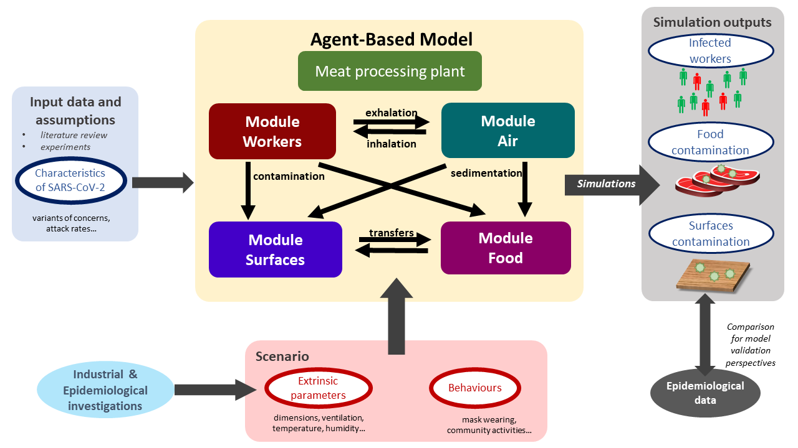
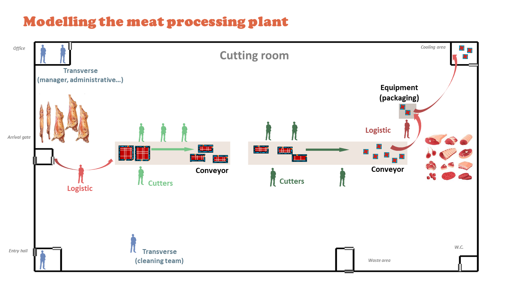
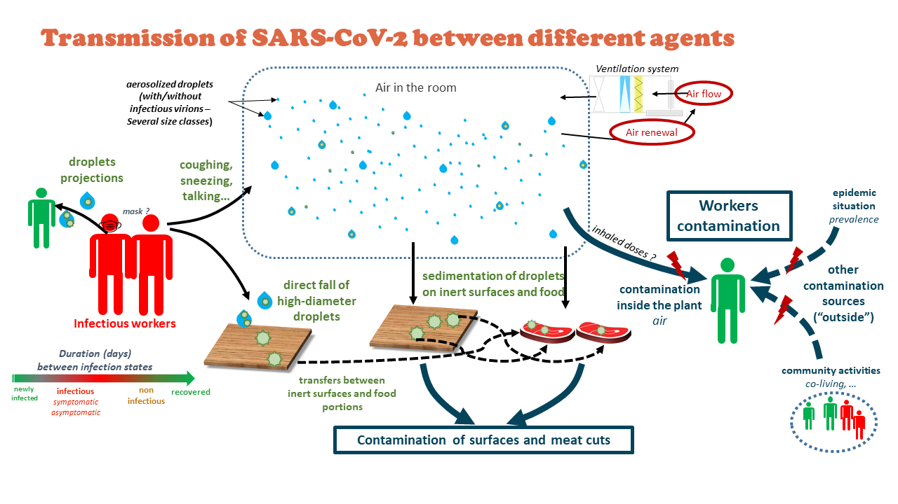
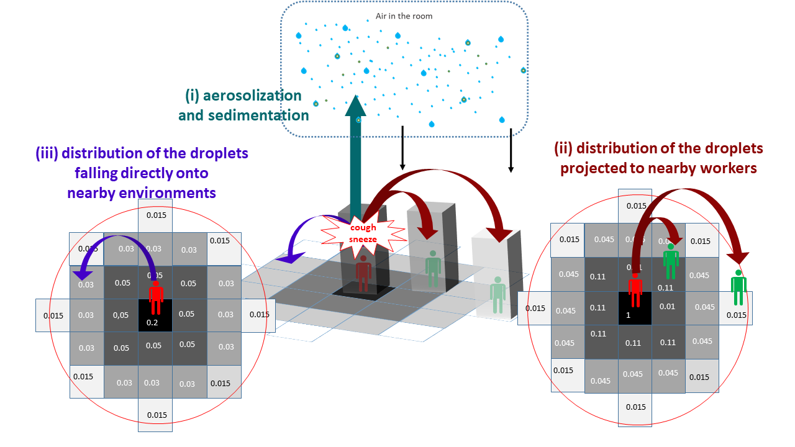
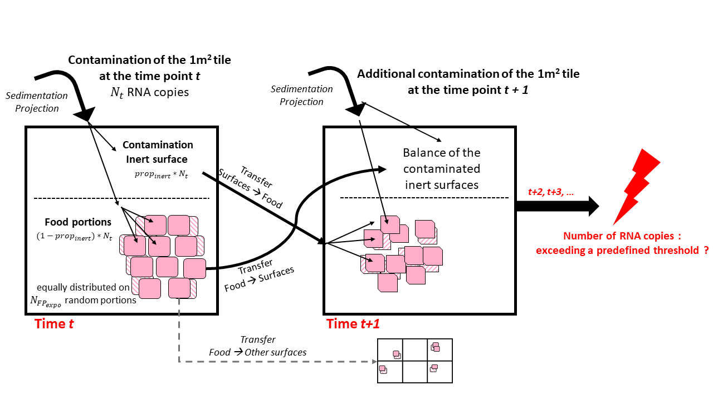

```{=html}
<style> div.main-container { max-width: 1200px; } </style>
```


**SACADA Project**

*April 2021 - September 2022*

```{r setup, include=FALSE}
knitr::opts_chunk$set(echo = FALSE)
library(dplyr)
library(ggplot2)
library(DiagrammeR)
library(kableExtra)
library(dplyr)
library(mvtnorm)
library(mc2d)
library(MASS)
library(survival)
library(fitdistrplus)
```

# Introduction

## Background

This modelling study aimed to...

The Agent Based Model considered three sources of contamination: the
exposition to SARS-CoV-2 througout working activities (aerosol and/or
fomites), the contamination throught the exposition outside the
processing plant for employees having shared activities in community
(transport and/or living).

## Objectives

In order to consider the first source of contamination (in the factory),
the durations of the stages of infections and the Viral load (viral RNA
concentration) exhaled by infected people have to be quantified. For
assessing the possibility of transmission in community the secondary
attack rate have to be quantified.

The different waves of Sars-CoV2 outbreaks that have occurred show that
each Variants of Concern, i.e. VoC (alpha, beta, delta and omicron
SARS-CoV-2 VoCs) have their own characteistics, e.g. different viral
load, or rates of reinfection [@Karim2021].

This document aims to identify the parameters of interest for building
the Agent Based Model of the ANR Sacada project.

# Agent-based modeling

The ABM model is presented in this study according to the
Overview-Design-Details (ODD) protocol as recommended by @Grimm2010.

## Overview

The outline of the agent-based modelling workflow developed in this
study is schematized in Figure \@ref(fig:FIG-abm-outline).

```{r FIG-abm-outline, echo=F, fig.align = 'center', out.width = "85%",fig.cap = "Outline of the Agent-based model to simulate the transmission of SARS-CoV-2 in meat processing facilities"}

```

-   **Purpose and patterns**

The developed model was aimed to predict ...

-   **States variables and scales - Parameters overview**

Several parameters were included in the model. On the one hand, some
parameters... On the other hand, based on multiple industrial and
epidemiological investigations, other parameters were included to
describe the behavior of the model in different scenarios. These
scenarios can be defined by ch as well as the behaviors of the agents

-   **Process overview and scheduling**

The model was divided in four separate modules describing different
agents evolving in the processing plant including (i) the workers, (ii)
the droplets in the air, (iii) the inert surfaces and (iv) the food
products, respectively. As schematized in Figure
\@ref(fig:FIG-abm-outline), different possible interactions between
these agents were described, such as the transmission of the droplets
probably containing viral particles between infectious workers and the
air through their respiratory activities (exhalation and inhalation),
the sedimentation of these droplets from the air onto inert surfaces
and/or food portions as well as the transfers between surfaces and food,
etc. Based on prior data or knowledge, spatiotemporal rules were defined
to simulate the interactions between modules and the properties of every
agents at successive time points distanced by a predefined short time
step (minutes). These step-by-step simulations were performed afterwards
for longer periods (days, weeks, etc.). At the end of these periods,
balances were calculated for different properties of the agents, e.g.
the total number of aerosolized or fallen droplets, the number of viral
gene copies inhaled by each worker, etc. Based on these balances,
several contamination indicators were estimated such as the total number
of infected workers, the number of contaminated food portions and
surfaces in the plant, etc. These estimated indicators could be compared
with collected epidemiological data for further model validation
purposes.

## Design concept

### Basic principles

The different agents integrated into the model for describing the
functioning of the meat processing plant are illustrated in Figure
\@ref(fig:FIG-abm-processing-plant). The model was implemented in the
way that end-users can include by themselves as input data the different
characteristics of the plant such as its dimensions, structures,
objects, etc. For instance, as shown in Figure
\@ref(fig:FIG-abm-processing-plant), the illustrated plant is made up of
several rooms / spaces including an entry hall for workers, an office, a
cooling area for food storage, a large area for meat cutting activities
with two conveyor belts for food transfers and a packaging machine, etc.
Different types of workers were considered in the model depending on
their respective activities, including the cutters, the logistic workers
as well as the ones with transverse activities. The number of workers of
each type present in the plant and their respective working rhythm and
timetable condition then the daily meat processing flow (meat quantity,
processing duration) of the overall plant. This processing flow was
described as successive transformation steps of the meat products: the
carcasses/half-carcasses arriving in the plant through the gate are
transported to the conveyors by logistic workers, become smaller meat
portions after different cutting steps carried out by cutters around the
conveyors and eventually packed and stored in the cooling area. Other
workers with transverse activities such as manager, administrative or
cleaning workers can also be present in the plant at different moments
depending on their respective timetable. Based on the overall timetable
of the plant, one can define rules for generating predefined or random
movements of every agents (workers, carcasses, meat cuts...) between
different locations in the plant at different time points. Determining
these movements over time will allow then to track the possible
transmission of the virus introduced by one or several infectious
workers in the plant.

```{r FIG-abm-processing-plant, echo=F, fig.align = 'center', out.width = "85%",fig.cap = "Illustration : Modeling the meat processing plant"}

```

The transmission of the virus from one or several infectious workers to
other susceptible workers, surfaces and food products are schematized in
the Figure \@ref(fig:FIG-abm-transmission). In this study, the duration
between the different successive infection phases were taken into
account from new infection to recovery with/without symptoms
development. The different infectious workers can exhale into the air,
through their respiratory activities or symptoms such as breathing,
talking, sneezing or coughing, different amounts of droplets containing
or not viral particles due to variability between workers and depending
on their behavior (mask wearing). These droplets of various sizes can be
aerosolized and/or fall afterwards onto inert surfaces and food products
depending on the characteristics of the ventilation system in each space
of the plant. Some high-diameter droplets sent out by the infectious
workers (e.g. in cases of sneezing or coughing) can also fall directly
onto surfaces without being aerosolized and/or projected towards nearby
workers. The total viral loads on different surfaces and/or food
products (meat cuts) are also enumerated; they are considered as
contaminated if the viral loads exceed a predefined threshold value. The
non-infected workers (susceptible workers) can inhale more or less of
droplets depending on their positions in the plant at different moments.
The cumulative viral doses inhaled by each susceptible worker at the end
of the day can then probably trigger an infection following a
dose-response relationship. At last, in addition of these possible
infections inside the plant, the model included also other contamination
sources outside the plant: the susceptible workers can get infected due
to the outside epidemic situation and or by community activities such as
co-living with infectious workers.

```{r FIG-abm-transmission, echo=F, fig.align = 'center', out.width = "85%",fig.cap = "Modeling the transmission of SARS-CoV-2 between different agents"}

```

### Prediction

The parameters

### Stochasticity

The stochasticity

## Details

### Sub-models - Modules

#### Food processing plant

##### Structures

The structure of the multi-room food processing plant can be included as
inputs of the model. Based on industrial investigations / interviews,
seven principal rooms (spaces) were included herein as an example to
define the plant structure, including the *Cutting room* (the main space
of the plant), *Entry hall* (for workers), *Arrival gate* (for food
arrival into the cutting room), *Cooling area* (for food storage),
*Waste area*, *W.C.*, and *Office* (illustration in Figure
\@ref(fig:FIG-abm-processing-plant)).

The different characteristics of each room are included as inputs of the
model:

-   dimensions of the plant and dimensions of the different rooms,
    expressed in $m$ (the length and width on two axes, denoted *X* and
    *Y* axes, respectively, and height on a 3rd axis, denoted *Z* axis);
-   positions of the room in the plant;
-   presence and relative positions of internal/external door for each
    room;
-   ventilation specifications: several air conditioning types can be
    indicated such as *Controlled Mechanical Ventilation* (CMV), *Direct
    Expansion Coil* (DEC) or *Air Handing Unit* (AHU).

The above characteristics were defined in the model as model parameters
based on industrial investigations or previous works. For example, each
room needs to be positioned on the entire workshop grid using a
numerical value between 0 and 1 indicating the relative position over
the axes. The cutting room is the main build by subtracting all other
rooms. The position of the internal and external doors can also be
mentioned using the predefined values *top*, *bottom*, *left* or
*right*.

```{r TAB-plant-room-parameters, eval=FALSE, include=FALSE}
data<-read.csv("csv/parameters_room_plant.csv",sep=";",header = T)
data<-as.data.frame(data)
data<-data[,]
knitr::kable(
  data,
  col.names = gsub("[.]", " ", names(data)),
  caption = 'IllustrParameters - Characterization of the multiroom processing plant.',
  table.attr = "style='width:85%;'"

) %>% 
  kable_styling('striped', font_size = 10) %>%
  pack_rows("*Entry hall* : The entry hall, or cloakroom, is located at the bottom left and allows the arrival of workers.", 3, 3) %>%
  pack_rows("*Waste area* :  waste disposal area is at the bottom.", 4, 4) %>%
  pack_rows("*W.C.* : The toilets are located at the bottom left.", 5, 5) %>%
  pack_rows("*Cooling area* : The cooling room is located at the top right.", 6, 6) %>%
  pack_rows("*Office* : The offices are located at the top left.", 7, 7) %>%
  pack_rows("*Arrival gate* : The product arrival gate, allows the supply of products, is located in the middle of the left" , 8, 8)
  
```

```{r TAB-plant-parameters, eval=FALSE, include=FALSE}
data<-read.csv("csv/parameters_plant.csv",sep=";",header = T)
data<-as.data.frame(data)
data<-data[,]
knitr::kable(
  data, col.names = gsub("[.]", " ", names(data)),
  table.attr = "style='width:85%;'",
  caption = 'Set of parameters used for charateryzing the plant.'
)%>%
  kable_styling('striped', font_size = 10)%>%
pack_rows("*Cutting room*" , 2, 6)%>%
pack_rows("*Entry hall*" , 7, 10)%>%
  pack_rows("*Waste area* ", 11, 14)%>%
pack_rows("*W.C.* ", 15, 18)%>%
pack_rows("*Cooling area* ", 19, 22)%>%
pack_rows("*Office*", 23, 26)%>%
pack_rows("*Arrival gate* " , 27, 30)%>%

## Justification line need to be edit
row_spec(4:6, color = "red")%>%
row_spec(8:10, color = "red")%>%
row_spec(12:14, color = "red")%>%
row_spec(16:18, color = "red")%>%
row_spec(24:26, color = "red")%>%
row_spec(29:30, color = "red")
     
```

##### Objects

The different objects or equipment can be included inside the plant such
as conveyors, peeler, etc. In the same ways as for the different rooms,
their dimensions and their relative position alongside the *X* and *Y*
axes are included as model inputs. As illustrated in Figure
\@ref(fig:FIG-abm-processing-plant), two types of objects were included
: two conveyor belts allowing to transport the different carcasses or
food portions from one point to another and an equipment that can be
shared by several operators (e.g.: a peeler, frequently used in meat
cutting plant).

```{r TAB-plant-object-parameters, echo=FALSE}
data<-read.csv("csv/parameters_object_plant.csv",sep=";",header = T)
data<-as.data.frame(data)
data<-data[,]
knitr::kable(
  data,col.names = gsub("[.]", " ", names(data)),
  table.attr = "style='width:85%;'",
  caption = 'Set of parameters for charateryzing the different objects in the plant. '

)%>%kable_styling('striped', font_size = 10) 

```

#### Workers

##### Type of workers

Different principal types of workers were taken into account in the
model depending on the their daily tasks inside the plant. According to
industrial investigations and expert knowledge, six types of workers
were included as following (Figure \@ref(fig:FIG-abm-processing-plant)):

-   *logistic1* : the workers in charge of bringing carcasses (or
    half-carcasses), arriving in the cutting room through the arrival
    gate, to the begin of the conveyor for cutting.
-   *cutter1* : positioned around the first section of the conveyor,
    denoted *conveyor1*, in charge of deboning, trimming and cutting
    carcasses into large pieces;
-   *cutter2* : workers in charge of cutting larges pieces from
    *cutter1* into smaller food portions;
-   *logistic2* : the workers in charge of transferring food portions
    from the cutting tables to the packaging or supplementary treatment
    equipment and storing packed products in the cooling area;
-   *transverse1*: administrative workers such as manager, chief or
    maintenance staff who mainly stay out of the cutting room during the
    work day;
-   *transverse2*: people from the cleaning team.

The total number of employees is defined as shown is Table
\@ref(tab:TAB-workers-parameters).

```{r TAB-workers-parameters, echo=FALSE}
data <- read.csv("csv/parameters_worker.csv",sep=";",header = T)
data <- as.data.frame(data)
data <- data[,-6]
knitr::kable(
  data,col.names = gsub("[.]", " ", names(data)),
  table.attr = "style='width:85%;'",
  caption = 'Set of parameters used for charateryzing the worker of the plant.'
) %>% 
  kable_styling('striped', font_size = 10) %>%
  pack_rows("*Overall proportion for different types of workers *" , 5, 10)

```

The workers were split afterwards into two teams, denoted *"team A"* and
*"team B"* according to their working shift (morning or afternoon) and
to their weekly schedule. In the model, this team dividing was included
by the parameters $p_{Team}$ (value between 0 and 1 representing the
proportion of each team) and set by default at $p_{Team}=0.5$ (equal
distribution between the two teams A and B). In each team, the types of
workers (cutters, transverse and logistic workers) were proportionally
distributed as described above. The two teams A and B alternatively
change their shift (morning/afternoon) from one week to another.
Finally, the workerschange the team (between the teams A and B) from one
week to another using a probability defined as model parameter, denoted
$p_{changeTeam}$, (value between 0 and 1), arbitrarily set at
$p_{changeTeam} = 0.05$.

##### Infection phases

The duration of different infections phases were taken into account in
the model and are schematized in Figure
\@ref(fig:FIG-infection-status)). The uncertainty ranges of the
different values have been identified for sensitivity analysis of the
hypothesis of the model (Table \@ref(tab:TAB-infection-duration)).

```{r FIG-infection-status, echo=FALSE, fig.align = 'center', out.width = "65%", fig.cap="Representation of the stage of infection for SARS-CoV2"}
g_InfectionPhases <- grViz("     
digraph Status{
node [shape=box]

Contamination[label='Newly infected']; 
Presymptomatic[style=filled, fillcolor=bisque4, fontcolor=white, label='Possible development of symptoms']; 
Infectious[style=filled, fillcolor=bisque4, fontcolor=white, label='Infectious'];
Symptomatic[style=filled, fillcolor=bisque4, fontcolor=white, label='Symptomatic']; 
Asymptomatic[style=filled, fillcolor=bisque4, fontcolor=white, label='Asymptomatic'];
Non_infectious[style=filled, fillcolor=bisque4, fontcolor=white, label='Non infectious'];
Recovery[label='Recovered'];

Contamination -> Infectious [label=' Latent phase (non-infectious)'];
Infectious -> Presymptomatic [label=' Presymptomatic phase (infectious)'];
Presymptomatic -> Symptomatic[label=' p(symp)',style = dotted];
Presymptomatic -> Asymptomatic[label=' 1 - p(symp)',style=dotted];
Asymptomatic -> Non_infectious[label=' Symptomatic phase (infectious)'];
Symptomatic -> Non_infectious[label=''];
Non_infectious -> Recovery[label=' Pre-recovery phase (non infectious)']

}
")
g_InfectionPhases
```

Once infected, individuals enter firstly into a presymptomatic phase
including (i) a latent period during which no virus can be detected and
(ii) individuals become infectious before symptom onset [@Lau2020]. The
duration of the latent period has been estimated to 3.3 days with 95% CI
[0.2-7.9] [@Zhao2021]. The infectious period of the presymtomatic period
has a length duration of 2 days (with an uncertainty range between 1 and
4 days) [@Byrne2020]. Considering the data available for the delta VoC
[@Kang2021; @Grant2021], the presymptomatic period duration was
considered to be equivalent for every VoCs. At the end of the
presymptomatic period, a proportion of the individual will develop
symptoms. Several studies are available for estimating this proportion
[@He2021; @Alene2021; @Ma2021; @Sah2021]. @Alene2021 estimated the
pooled proportion of asymptomatic COVID-19 cases throughout the course
of infection was 25% (with 95%CI: 16%-38%). @Ma2021 estimated that the
pooled percentage of asymptomatic infections among the confirmed
population was 40.50% (with 95%CI: 33.50%-47.50%). @Sah2021 estimated
that percentage at 35.1% (with 95% CI: 30.7-39.9%). In our study, the
mean of these three percentages has been used as model parameter,
*pAsymptom*, i.e. 33.5%. The range of possible values was also derived
from the 95%CI of these studies and set between 16% and 47.5% in our
study.

For the sub-population who develops symptoms, the duration of their
symptomatic period has been found uncertain according to studies
[@Byrne2020]. The duration of the different symptoms differ according to
their nature [@Santos2021]. From the onset of symptoms to recovery, a
period of 13 days can be considered with an uncertainty range comprise
between 11 and 16 days [@Byrne2020]. During that period, virus can be
detected but it as estimated that infectiousness becomes usually low
after 7 days [@He2020]. The uncertainty range for the infectiousness
period can be estimated from @Byrne2020. They stated that virus
detection overestimates the infectious period on average by 2-6 days.
@vanKampen2021 provide another estimation of the uncertainty range of
infectiousness period. They considered the duration between 5 and 11
days. The value of 8 days [@vanKampen2021] was used in the model .

```{r TAB-infection-duration, echo=FALSE}
data<-read.csv("csv/parameters_duration.csv",sep=";",header = T)
data<-as.data.frame(data)
data<-data[,-6]
knitr::kable(
  data,col.names = gsub("[.]", " ", names(data)),
  table.attr = "style='width:85%;'",
  caption = 'Set of parameters used for charateryzing the durations of the SARS-CoV2 infection.'
)%>%kable_styling('striped', font_size = 10)

```

##### Individual variability

Among the infection phases described previously, the model considered
the viral load emitted by the different workers only during their
infectiousness period. Viral loads were considered to be similar between
asymptomatic and symptomatic persons according to a study of @Walsh2020
and assumed to be constant during the whole infectiousness period. The
inter-individual variability of virus load in sputum and the VoC was
taken into account in the ABM model: parameters characterizing this
variability were estimated by fitting triangular probability
distributions on literature [@Jones2021; @Teyssou2021; @Luo2021;
@Wang2021] (see Appendices... ). Estimated values of these parameters
are gathered in Table \@ref(tab:TAB-load-VoC).

```{r TAB-load-VoC, echo=FALSE}
data <- read.csv("csv/parameters_vload.csv",sep=";",header = T)
data <- as.data.frame(data)
data <- data[,-7]
knitr::kable(
  data, col.names = gsub("[.]", " ", names(data)),
  table.attr = "style='width:90%;'",
  caption = "Parameters characterizing inter-individual variability of viral loads (expressed in log10 copy/ml) in sputum."
) %>%
  kable_styling('striped', font_size = 10)

```

##### Secondary attack rate

The secondary attack rate (SAR) parameter used to estimate the
probability of contraction SARS-CoV-2 for the workers having community
activities outside the plant such as co-living. The SAR of the original
and *alpha* VoCs has been found by @Fung2021 to be equal to 17.1% (95%CI
13-21%). According to @Singanayagam2021, the SAR was found to be 38% for
*delta* variant (with 95%CI 24-53%) in case of unvaccinated people, and
25% (with 95%CI 18-33%) for vaccinated people. The SAR for *omicron* is
respectively 1.2 for vaccinated and 2.6 times more important than for
delta [@Lyngse2021]. These different SAR parameter values included in
the model are shown in Table \@ref(tab:TAB-SAR).

```{r TAB-SAR, echo=FALSE}
data <- read.csv("csv/parameters_sar.csv",sep=";",header = F)
tabcolnames <- data[1,-8]
data <- as.data.frame(data[-1,-8])
row.names(data) <- 1:nrow(data)
knitr::kable(
  data,
  col.names = tabcolnames,
  table.attr = "style='width:100%;'",
  caption = 'Secondary attack rates in household for different variants of concern and vaccination statuses.'
) %>%
  kable_styling('striped', font_size = 10)

```

##### Infection probability

The possible triggering of the first infection phase for each worker was
modeled using a dose-response modelling approach, considering the viral
quantity inhaled by each one. Among different dose-response models
proposed in the literature (see more details in the section
\@ref(dose-response-model-parameters) ), the Watanabe model
[@Watanabe2010] was chosen herein to describe, for each worker, the
probability to get infected as function of the number of inhaled virions
(infectious virus), denoted \$dose\$, as follows:

$$
P(infection) = 1 - \exp(-r * dose)
$$

where $r$ is the shape parameter defining the exponential form of the
no-threshold model is a no-threshold model. The value of \$r\$,
estimated at $r=0.00246$ [95%CI 0.00128-0.00527] based on literature
data (cf. section \@ref(dose-response-model-parameters)) was used herein
in the ABM model. It is also worth noting that the concentration of
SARS-CoV-2 expressed in gene copies (e.g. RNA copies) or in infectious
virus are strongly different. Important ratios between these
concentrations have been suggested in the literature, varying from a
factor of 100 to 1000 between the number of genes copies and the
infectious viral particles [@Miller2021; @Pitol2021]. This factor,
denoted $f_{RNA/virion}$, was included in the ABM model with a
arbitrarily chosen value of 500 as well as the 95%CI between 100 and
1000.

##### Working days

#### Air

##### Exhalation

The initial source of SARS-CoV-2 was considered through different
respiratory activities of the infectious workers emitting droplets of
various sizes. The number of droplets (expressed as $s^{-1}$ )
(containing or not viral particles) emitted over time was modeled as
follows :

$$
\dot N_{exh, d} = \dot Q\upsilon_{exh} * C_d * (1-eff_m), 
$$

where $\dot Q\upsilon_{exh}$ ($m^3.h^{-1}$) corresponds to the exhaled
volumetric air flow rate, $C_d$ ($\#.m^{-3}$ ) is the viral
concentration of droplets of diameter $d$ and $eff_m$ corresponds to the
efficacy of the mask if correctly worn (otherwise, $eff_m = 0$). The
correct mask wearing was described using a parameter called the mask
acceptability, denoted $p_{mask}$, corresponding to the proportion of
the workers constantly wearing a mask during their working day. Several
types of mask can be included as input of the model such as surgical
mask or FFP2, with their respective efficacy and acceptability.

The volumetric airflow rate was assumed to vary between the different
workers depending on their physiology and the intensity of their
activities. Based on data obtained by @Buonanno2020, the ABM model
considered six size classes for the droplets with the midpoint diameters
$d$ at 0.8, 1.8, 3.5, 5.5, 20 and 100 $\mu m$, respectively. Several
respiratory activities (events) were taken into account in the model,
including *breathing*, *talking*, *talking loud* (based on study by
@Morawska2009), *coughing* and *sneezing* (SARS-CoV-2 symptoms). In this
study, based on estimations from literature data, we assumed that each
droplet contained one viral RNA copy (cf. section Appendices
\@ref(assumption-for-droplets-contamination)). The droplet
concentrations $C_d$ associated with each droplet class emitted during
each respiratory activity (event) estimated from studies by
@Morawska2009, [Kennedy2009, Duguid1946]{.underline} are gathered in
Table \@ref(tab:TAB-air-Cd).

```{r TAB-air-Cd, echo=FALSE}
data <- read.csv("csv/parameters_air_Cd.csv",sep=";",header = F)
tabcolnames <- data[1, ]
data <- as.data.frame(data[-1,])
row.names(data) <- 1:nrow(data)
knitr::kable(
 data,
 col.names = tabcolnames,
 table.attr = "style='width:85%;'",
 caption = 'Droplets concentration emitted during different respiratory activities and for different droplet size classes.'
) %>%
 kable_styling('striped', font_size = 10)
```

The occurrence frequency of the above respiratory activities during a
time step varied from one worker to another, depending on their working
activities as well as their infection phases. For example, [Birring2006
and Hsu1994]{.underline} suggested average coughing frequencies at 2
coughs per hour for healthy patients and 47 coughs per hour for
symptomatic patients. Such variability between infection statuses was
also suggested for the sneezing frequencies ([Hansen&Mygind2002,
Musch2021]{.underline}). These SARS-CoV-2 symptoms frequencies
$f_{cough/sneeze}$ (expressed in $\#.min^{-1}$) included in the model
are gathered in Table \@ref(tab:TAB-air-freq).

```{r TAB-air-freq, echo=FALSE}
data <- read.csv("csv/parameters_air_freq.csv",sep=";",header = F)
tabcolnames <- data[1, ]
data <- as.data.frame(data[-1,])
row.names(data) <- 1:nrow(data)
knitr::kable(
 data,
 col.names = tabcolnames,
 table.attr = "style='width:65%;'",
 caption = 'Frequency of different SARS-CoV-2 symptoms (expressed as the number of occurrences per minutes).'
) %>%
 kable_styling('striped', font_size = 10)
```

Based on the frequencies below, during a given several-minute time step
$dt$, the probability to have a coughing/sneezing event for a worker was
calculated by $p_{cough/sneeze} = f_{cough/sneeze} * dt$. If no symptoms
are observed during this time step, the worker was considered to have
one of the three remaining respiratory activities, i.e. breathing,
talking or talking loud, with supposedly equal probability.

##### Aerosolization criteria

The different droplets emitted by the workers can be aerosolized
(suspended in the air) [@BazantBush2021] or fall directly onto the
nearby environments (including nearby workers, inert surfaces or food
products) depending on the size of the droplets and the ventilation
system in the room. In this study, a criterion was used to determine if
in a given room $r$ a droplet of diameter $D_d$ (size class $d$) will be
aerosolized by comparing its sedimentation time, denoted $t_{sed,r,d}$,
with the circulation time of the airflow in the room, denoted
$t_{circ,r}$.

On the one hand, assuming that all droplets were uniformly distributed
in the air, their sedimentation time was calculated as follows:

$$
t_{sed,r,d}= \frac{H_r}{\upsilon_{sed,d}},
$$

with $H_r$ (in $m$) corresponds to the height of the room and
$\upsilon_{sed,d}$ (in $m.s^{-1}$) is the settling velocity of the
droplets. The velocity was calculated using the Stokes law:

$$
\upsilon_{sed,d} = \frac{g*(\rho_{water}-\rho_{air})*D_d^2}{18*\mu},
$$

where $g$ (in $m.s^{-2}$) is the gravity acceleration; $\rho_{water}$
and $\rho_{air}$ (in $kg.m^{-3}$) are the mass density of the droplets
and the air, respectively and $\mu$ is the dynamic viscosity
($kg.m^{-1}.s^{-1}$).

On the other hand, the circulation time of the airflow in the room $r$
was calculated as the ratio between the volume of the room $V_r$ ($m^3$)
and the volumetric airflow rate $\dot Q\upsilon_r$ ($m^3.h^{-1}$):

$$
t_{circ,r} = \frac{V_r}{\dot Q \upsilon_r},
$$

with the value of $\dot Q \upsilon_r$ depending on the user-defined
ventilation characteristics of the room. This airflow rate was
equivalent to (i) the air mixing rate for Air Handing Unit and Direct
Expansion Coil systems or (ii) the renew airflow rate for Controlled
Mechanical Ventilation (CMV) systems. Droplets of diameter $D_d$ in the
room $r$ were then considered as aerosolized under the following if:

$$
t_{sed,r,d} > 10 * t_{circ,r},
$$

otherwise, they were considered as sedimented onto nearby environments.
The total number of droplets sedimented in the room was then calculated
as follows:

$$
\dot N_{sed,d,r} =\upsilon_{sed,d} * S_r, 
$$

with $S_r$ (in $m^2$) corresponding to the area of the room.

##### Falling & projection

As previously mentioned, the droplets of various sizes were considered
in the model from emission by infectious workers through their
respiratory activities (breathing, talking, etc.). Besides aerosolized
or sedimented droplets after a given time step described above, one also
considered a fraction of the emitted droplets (mostly the ones with
high-diameters) that could possibly fall directly onto nearby
environments and/or in the direction of nearby workers following
coughing/sneezing events. These events, when they occurs (cf.
frequencies in Table \@ref(tab:TAB-air-freq)), gave then three different
paths for the circulation of the droplets emitted by an infectious
worker, including (i) a fraction going to the aerosol and sedimented
afterwards as described in the previous sections, (ii) a variable
fraction projected in the direction of nearby susceptible workers
depending on the distance between them and the infectious one and (iii)
a variable fraction fallen / dropped directly on nearby environments
(see Figure \@ref(fig:FIG-abm-pzone)).

```{r FIG-abm-pzone, echo=F, fig.align = 'center', out.width = "85%",fig.cap = "Distribution of the falling and projected droplets onto nearby environments and workers due to coughing or sneezing events."}

```

In this study, for simplification purposes, the spatial environments in
the plant were divided into one-square-meter tiles where different
agents (workers, inert surfaces or food products) can be present at a
same given time. The fractions of falling / projected droplets (paths ii
and iii) were spatially distributed afterwards into sub-fractions for
the nearby square tiles depending on the distances separating them and
the infectious worker. These spatial distributions were estimated based
on data obtained previously by [Duguid1946, Nicas2005, Li2021, Lie2020
and Jung2022]{.underline} and shown in Figure \@ref(fig:FIG-abm-pzone)
(for more details, see Appendices
\@ref(distribution-of-the-projected-droplets)).

##### Inhalation

The total number of droplets (containing viral RNA copies) inhaled by
each worker (by breathing in small droplets from the air or by being
exposed to direct droplets projections) was tracked for each time point.
The total exposure to the virus of each worker was calculated as the
cumulative number of RNA copies inhaled at the end of the day. This
exposure, converted afterwards as a number of infectious virions using
the conversion factor $f_{RNA/virion}$, was included in the
dose-modelling step to determine if a possible infection may occur (cf.
section \@ref(infection-probability)).

#### Surfaces

As previously described in the section \@ref(falling-projection),
droplets can sediment or fall onto different areas that were divided
into one-square-meter tiles. In the study, all inert surfaces (e.g.
surfaces of the conveyor belts and the equipment) located on those tiles
were considered as agents of the ABM model with their own spatial
coordinates. During the working day, the quantity of contaminated
droplets could be accumulated and probably transferred from or to
aerosol or food portions present on these inert surfaces. These droplet
accumulations were calculated at the end of the day to determine the
contamination level of each inert surface tiles, expressed as the total
number of viral RNA copies per $m^2$. Considering a possible factor
between this total of RNA copies and the estimated quantity of virions
as well as an experimental limit of detection, a surface tile was
considered as contaminated by infectious viruses (*positive*
contamination) if its droplet accumulation exceeded a predefined
threshold values. In this study, the contamination was computed for
several threshold levels varying from 3 to 9 $\log_{}10$ viral RNA
copies in order to deal with possible uncertainties in the RNA/virions
factor and the limit of detection. At the end of the day, once the total
number of contaminated surfaces as well as their corresponding spatial
coordinates were determined, all droplet accumulations were reset at 0
since all inert surfaces were assumed to be daily cleaned by the
*transverse2* workers.

#### Food

##### Food processing

The meat cutting process was described herein accordingly to the module
Workers (cf. \@ref(type-of-workers)) as a multi-step process from the
arrival gate to the storage area. The agents *food portions* were
computed with a flexible flow:

-   Firstly, two principal input parameters were used to describe the
    quantity of processed meats depending on the type of meat processed
    in the plant (e.g. *porcine, bovine,* etc.), including (i) the
    average weight of the carcasses arriving at the begin of the cutting
    process and (ii) the net weight ratio describing the yield obtained
    at the end of the process by excluding other non-consumable parts of
    the carcasses;

-   After all cutting steps, the final food portions could be various
    sizes and weights depending on the market/consumers demand. For
    simplification purposes, an agent *food portion* was defined as a
    portion with a given *consumer sales unit* (CSU), i.e. the average
    weight of the final portion (expressed in $kg$) obtained at the end
    of the cutting process;

-   Based on expert knowledge and interviews with industrial factories,
    the quantity of meat processed during a period was assumed to the
    depend to the working rhythm of each worker type (*logistic,
    cutter1, cutter2*, etc.). These rhythms were included as parameters,
    for each type of meat and type of workers, expressed at a ratio
    corresponding to the expected weight proportion of the carcass
    processed during a given period. For example, the working rhythm of
    the *cutter1* workers in a porcine processing plant equal to 0.2
    $min^{-1}$ correspond to their capacity to cut 20% of a pork carcass
    during one minute into different portions ready to go to the
    subsequent processing steps;

-   The working rhythm can be different from one worker category to
    another, therefore, different food portions can be accumulated over
    time on the same working surfaces (conveyor belts or equipment).
    This accumulation will condition then the duration of every meat
    portions spatially distributed in the plant during the different
    cutting steps: for example, several meat portions can stay 5 minutes
    in the first cutting step (deboning) but 10 minutes in the second
    one (slicing, chopping, etc.) requiring more time to be done;

-   Knowing the above duration for each cutting step, the different food
    portionswere spatially distributed at different step-dependent
    locations in the plant (e.g. *cutting1-conveyor1-5minutes*). It is
    worth noting that locations such as the conveyor belts may represent
    several spatial *X-Y* coordinates depending on their dimensions. The
    spatial distribution of the meat portions on the conveyors was
    computed in the way that the different portions from the same
    carcass were at the same location during a given period but could
    possibly have different random coordinates (simplification purposes
    for modeling the movement of the conveyor belts);

-   Finally, depending the total number of workers present in the plant
    at a given working day, the total number of agents *food portions*
    as well as their spatiotemporal distributions were accordingly
    computed.

As for the inert surfaces (cf. section \@ref(surfaces)), the
contamination of the meat products was considered if the viral RNA
accumulation in each portion (through sedimentation, projection or
transfers by contact) exceeds pre-defined threshold levels. This
accumulation was calculated for each portion at the entry of storage
area (end of cutting process). Based on the chosen threshold level, the
contamination percentage was calculated at the end of each day as the
ratio of the number of contaminated portions over the total number of
processed ones during the considered day.

##### Transfers by contact

```{r FIG-abm-transfers, echo=F, fig.align = 'center', out.width = "85%",fig.cap = "Tranfers of the droplets between the different inert surfaces and food portions"}

```

### Input data

#### Reference scenario

Scenario chosen based on an epidemiological investigation on several
SARS-CoV-2 clusters in France during the period between May 2020 and
April 2021.

For each simulation, the model was initialized at the first day with an
initial number of infected workers $n_{Contaminated-Init} = 1$

#### Model parameter values

## Parallel computing

Calculation / technical requirements / Migale

## Convergence check

approach for convergence /

# Appendices

## Individual variability in viral load

Among the infection phases described previously, the model considered
the viral load emitted by the different workers only during their
infectiousness period. Viral loads were considered to be similar between
asymptomatic and symptomatic persons according to a study of @Walsh2020
and assumed to be constant during the whole infectiousness period.
Parameters characterizing inter-individual variability (min, mode and
max values) were estimated by fitting triangular probability
distributions on data collected by @Jones2021 on presymptomatic,
asymptomatic, and mildly symptomatic (PAMS) cases. The latter
corresponds to the *alpha* variant (that is B.1.1.7). The viral load of
the alpha variant was found to be 1 $\log_{10}$ higher than the original
SARS-CoV-2 strain [@Teyssou2021].

```{r FIG-triangular, warning = FALSE, echo=FALSE, fig.align='center', fig.cap="Fitting of a triangular distribution to virus load measurements (expressed in log10 copy/ml) on data obtained by Jones et al (2021)."}
load <- read.csv("csv/viral_load.csv",sep=";",header = T)
f1<-fitdist(load$log10Load, "triang", method="mge", start = list(min=2, mode=6,max=9), gof="CvM")
plot(f1)
```

The parameters of the triangular distribution used to describe
variability of viral load are respectively,
min=`r round(f1$estimate[1],1)`, mode=`r round(f1$estimate[2],1)` and
max=`r round(f1$estimate[3],1)`. The *delta* VoC is associated with
higher viral load [@Luo2021; @Wang2021; @Teyssou2021]. The concentration
of delta VoC was found to be 2 times more important than for *alpha*
[@Teyssou2021]. Other differences observed in *Ct* values suggest that
the difference could be higher [@Luo2021; @Wang2021]. Therefore, the
distribution of viral load was considered to be shifted by 0.5
$\log_{10}$ from *delta* with an uncertainty range between 0.3 and 1
$\log_{10}$. Finally, the level of viral load for *omicron* VoC was
found to be similar to *delta* [@Lyngse2021]. All estimated parameters
are gathered in Table \@ref(tab:TAB-load-VoC).

## Dose-response model parameters

Dose-response modelling is the process of using mathematical
relationships to describe the probability of an adverse health effect
(e.g., infection, illness) occurring in an individual or the frequency
of an adverse health effect in a population when that individual or
population is exposed to a specific dose of pathogenic microorganisms.
Two types of modelling approaches can be distinguished [@Haas2002]. In
the first, it is considered that there is a cooperation between
ingested/inhaled microorganisms, involving the notion of minimum
infective dose: the infection is the result of the combined action of
multiple micro-organism units, and it becomes possible only if the dose
exceeds a threshold (the so-called "minimal infective dose"). In the
second approach it is assumed on an independence of action of
microorganism units. Each microorganism unit has a non-zero chance of
causing infection on its own. For SARS-CoV-2, as for other infectious
pathogens, the models currently used are based on the single hit model
theory and the absence of a threshold [@Poydenot2021].

-   **Exponential dose response model**

The exponential model is a no-threshold model, where the probability of
infection (*r*) for a virion particle is constant, and the number of
virions inhaled is not perfectly known but assumed to follow a Poisson
distribution of parameter *d* . The hypothesis of the constancy of *r*
means that the result of the interaction between host, microorganism and
environmental factors does not vary much between exposed individuals.
The Poisson distribution is applicable in case the contamination is
considered homogeneous. This assumption appears suitable for
characterizing droplet distribution in the air. The probability of being
infected following the inhalation of air in which the average
contamination is equal to *d* is expressed as follows:

$$P(\mathrm{infection}|d)=1-\exp(-r/d)$$

```{r FIG-DRM-exponential, echo=FALSE, fig.align='center',fig.cap='Examples of the exponential dose-response model for calculating the probability opf infection according to the dose for different *r* values**', out.width = "50%"}
dose<-seq(-1,6,0.01)
dose<-10^dose
n<-length(dose)
dose_g<-c(dose,dose,dose,dose)

r1<-0.01
p1=1-exp(-r1*dose)
tag1<-rep("r=0.01",n)

r2<-0.001
p2=1-exp(-r2*dose)
tag2<-rep("r=0.001",n)

r3<-0.0001
p3=1-exp(-r3*dose)
tag3<-rep("r=0.0001",n)
         
r4<-0.00001
p4=1-exp(-r4*dose)
tag4<-rep("r=0.00001",n)

data<-data.frame(dose=dose_g,p=c(p1,p2,p3,p4),tag=c(tag1,tag2,tag3,tag4))

g1<-ggplot(data=data,aes(x=log10(dose),y=p,group=tag))+geom_line(aes(x=log10(dose),y=p,color=tag),size=1.5)+
  xlab("Dose (in log10(virions))")+ylab("Probability of infection")+labs(col="r values")+theme_bw(base_size = 12) + 
  scale_color_manual(values=c('steelblue1','steelblue2','steelblue3','steelblue4'))+ theme(panel.grid.minor = element_blank())
g1
```

-   **Wells-Riley model**

The Wells-Riley model can also be used to calculate the probability of
infection based on given dose [@Wells1955; @Sze2010]. It also relies on
the hypothesis of a random distribution of the pathogen in the air. But
it uses another parametrisation compared to the exponential
dose-response model. The quantum of infection *q* is used. *q*
corresponds to a quantity of inhaled virions for which the probability
of infection in the population is 63%.

$$P(\mathrm{infection}|d)=1-\exp(-d/q)$$

```{r FIG-DRM-WR, echo=FALSE, fig.align = "center", fig.cap='Illustration of the notion of quantum of infection. *q* = 100 in this example',  out.width = "50%"}
dose<-seq(-1,6,0.01)
dose<-10^dose

r1<-0.01
p1=1-exp(-r1*dose)

data1<-data.frame(dose=dose,p=p1)

g2<-ggplot(data=data1,aes(x=log10(dose),y=p))+geom_line(color='steelblue1',size=1.5)+
  xlab("Dose (in log10(virions))")+ylab("Probability of infection")+theme_bw(base_size = 12) +
geom_segment(aes(x = 2, y = 0, xend = 2, yend =0.63),linetype="dotted",color="lightsteelblue3",size=1.5)+
  geom_segment(aes(x = -1, y = 0.63, xend = 2, yend =0.63),linetype="dotted",color="lightsteelblue3",size=1.5)+ scale_x_continuous(expand = c(0,0))+  theme(panel.grid.minor = element_blank())
g2
```

-   **Comparison of models**

No data have been used so far for fitting an exponential dose response
curve for Sars-Cov2 [@Parhizkar2021]. However prior work has shown that
dose-responses for other coronaviruses [@Watanabe2010; @Haas2021]. This
dose-response has been used in several risk assessment for Sars-Cov2
[e.g. @Pitol2021].

@Prentiss2020 provided some estimates of *q* values based on estimation
of exposure and observed attack rates. Six values were obtained from 6
six different situations were the attack rates. The values ranged from
322 to 3012. @Augenbraun2020 assumed a conservative value of *q* equal
to 100.

Figure \@ref(fig:FIG-DRM-compare) compared the exponential dose response
derived from @Watanabe2010 and available in
[QMRAwiki](http://qmrawiki.org/experiments/sars) and the values derived
from @Prentiss2020.

```{r FIG-DRM-compare, echo=FALSE, fig.align = "center", fig.cap='Comparison of different dose-response models', out.width = "50%"}

dose<-seq(-1,6,0.01)
dose<-10^dose
n<-length(dose)
dose_g<-c(dose,dose,dose,dose)

rwl<-0.00128
rwm<-0.00246
rwu<-0.00527
pwl=1-exp(-rwl*dose)
pwu=1-exp(-rwu*dose)

qpl<-3012
qpu<-322
ppl=1-exp(-dose/qpl)
ppu=1-exp(-dose/qpu)

tag1<-rep("Watanabe model 2.5%",n)
tag2<-rep("Watanabe model 97.5%",n)
tag3<-rep("Prentiss lower quantum",n)
tag4<-rep("Prentiss higher quantum",n)

data<-data.frame(dose=dose_g,p=c(pwl,pwu,ppl,ppu),tag=c(tag1,tag2,tag3,tag4))

g3<-ggplot(data=data,aes(x=log10(dose),y=p,group=tag))+geom_line(aes(x=log10(dose),y=p,color=tag),size=1.5)+
  xlab("Dose (in log10(virions))")+ylab("Probability of infection")+labs(col="r values")+theme_bw(base_size = 12) + 
  scale_color_manual(values=c('steelblue1','steelblue1','bisque3','bisque3'))+ theme(panel.grid.minor = element_blank())
g3
```

The Watanabe's model provided a conservative estimate of the infection
probability. The best fit value for $r = 0.00246$ was used in the
SACADA_ABM model. The 95% CI are used in the sensitivity analysis of the
model (**0.00128** and **0.00527**).

-   **Expression of dose to assess probability of infection**

Evidence suggests that the concentration of SARS-Cov2 expressed in gene
copies or in infectious virus are strongly different. Different ratios
have been proposed to account of this difference. Infective virus are
though to be from 100 to 1000 lower than gene copies [@Miller2021;
@Pitol2021]. The value of 500 is used in SACADA_ABM. The values of 100
to 1000 will be used in the sensitivity analysis.

## Assumption for droplets contamination

(SD)

## Distribution of the projected droplets

(SD)

# References
